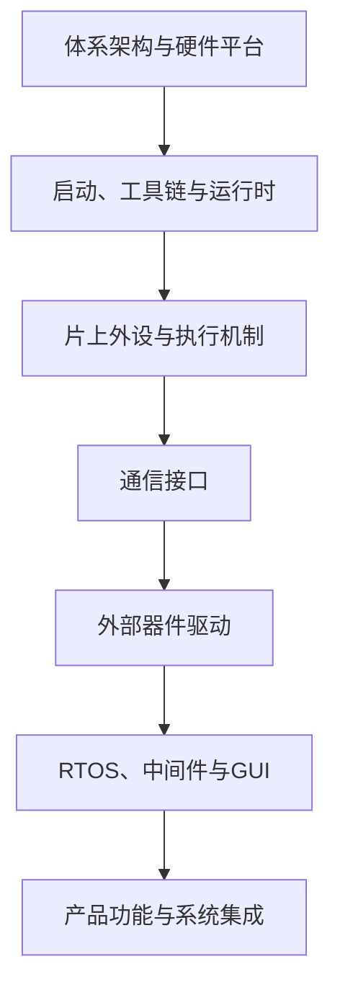

# 嵌入式开发学习链路

## 这不是学习计划

本页描述技术之间的依赖关系，不规定按周、按月或按阶段学习。进入点由当前问题决定；遇到缺失前提时沿上游补齐，完成实现后沿下游验证。

## 总链路

这条链表达依赖方向，不代表每个项目都必须经过所有节点。GUI、网络、RTOS等是按需求进入的分支；不同分支最终在产品功能处汇合。

## 分链入口

| 分链 | 解决的问题 | 入口 |
|---|---|---|
| MCU固件 | 程序如何在MCU上启动、运行并控制片上资源 | [[00-导航/MCU固件链路]] |
| 外部器件驱动 | 如何把数据手册转成稳定的软件接口 | [[00-导航/外部器件驱动链路]] |
| RTOS并发 | 多个职责如何调度、通信和同步 | [[00-导航/RTOS并发链路]] |
| 图形界面 | 输入、应用、框架、渲染和显示如何衔接 | [[00-导航/图形界面链路]] |
| RK/Linux | SoC启动、内核、设备和用户态如何衔接 | [[00-导航/RK与嵌入式Linux链路]] |
| 跨平台迁移 | 业务与驱动如何跨STM32、AT32、GD32、ESP32迁移 | [[00-导航/跨平台迁移链路]] |
| 反向排障 | 如何从功能现象逆向定位到具体层 | [[00-导航/反向排障链路]] |

## 关系词

- **上游**：当前节点成立所依赖的知识或实现。
- **下游**：使用当前节点输出的功能。
- **并行**：可独立推进、最后在更高层汇合的分支。
- **可替代**：承担相同位置但实现不同的技术选项。
- **汇入**：多个分支共同支撑的系统能力。

## 使用方法

1. 从需求、设备或故障现象选择一条分链。
2. 找到当前节点，检查它的直接上游是否已具备。
3. 只补齐阻塞当前任务的上游，不追求把整个领域预先学完。
4. 用[[00-导航/实践验证索引]]验证节点或相邻两层之间的连接。
5. 出现异常时切换到[[00-导航/反向排障链路]]，由下游向上游回溯。

## 深度边界

- MCU固件、外部器件驱动、RTOS、GUI和系统集成是主要参与层。
- BSP、设备树、U-Boot、Kernel与简单Linux驱动按项目需要进入。
- 原理图、PCB、硬件兼容性和信号干扰只作为识别边界与转交条件，不扩展为硬件设计主线。
