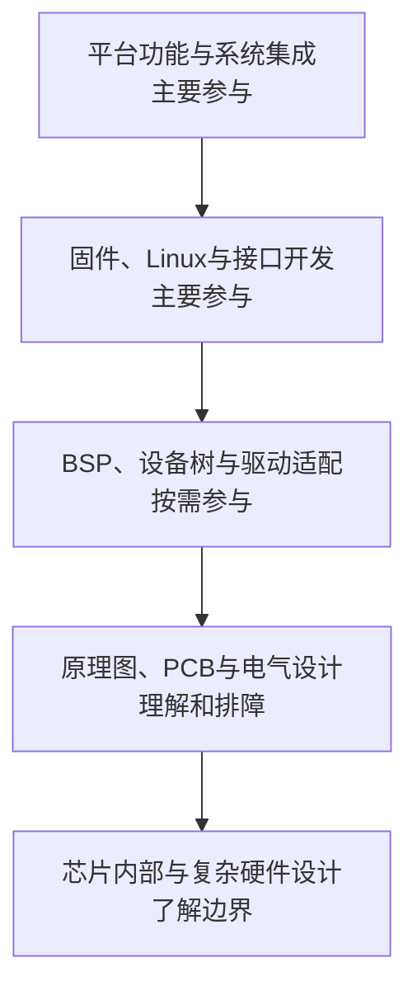

# 技术全景图

## 参与关系

## 技术板块

| 板块 | 定位 | 目标 |
|---|---|---|
| 系统基础 | 共同语言 | 理解MCU、SoC、启动、内存和系统分层 |
| 工具链与调试 | 核心能力 | 建立可观察、可复现的开发闭环 |
| MCU固件 | 主要参与 | 独立实现外设、协议、状态机和RTOS功能 |
| RK与Linux | 主要参与 | 构建系统、配置平台、访问设备并部署服务 |
| 接口与通信 | 主要参与 | 完成端到端通信和异常处理 |
| BSP与驱动 | 按需参与 | 修改设备树和已有驱动，定位底层问题 |
| 硬件理解 | 理解层 | 看懂连接、电平、供电并辅助排障 |
| 应用案例 | 横向验证 | 组合多个纵向能力验证掌握程度 |

## 链路视角

技术板块是分类目录，不代表学习先后。跨目录的依赖、分支和汇入关系由[[00-导航/嵌入式开发学习链路]]组织；具体项目可以从任意需求节点进入，再沿上游补齐依赖。

## 核心原则

不以“所有层都深入”为目标，而以系统可实现、可观察、可诊断、可维护为判断标准。
