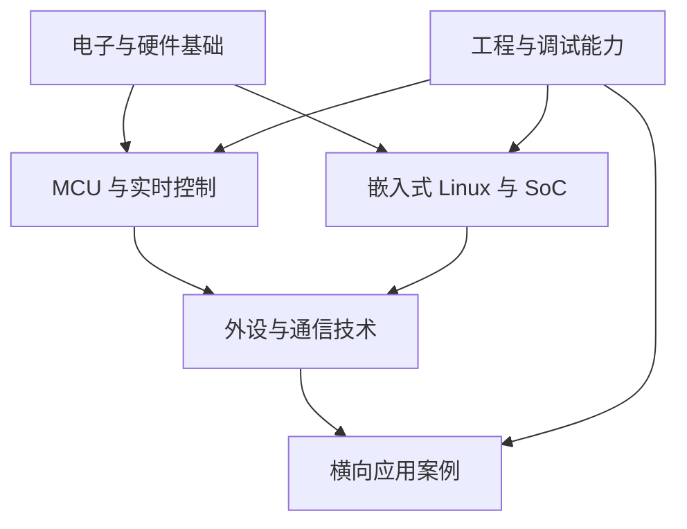

# 技术全景图

## 知识体系

## 纵向技术主干

| 主干 | 主要内容 | 代表对象 |
|---|---|---|
| 电子与硬件基础 | 电平、供电、时钟、复位、原理图 | 通用基础 |
| MCU 与实时控制 | 外设、中断、DMA、RTOS、低功耗 | STM32 |
| 嵌入式 Linux 与 SoC | 启动链、内核、设备树、驱动、应用 | Rockchip RK |
| 外设与通信 | 有线、无线、传感、显示和执行器 | NFC、电子纸等 |
| 嵌入式工程 | 工具链、调试、选型、可靠性、版本管理 | 全部技术领域 |

## 学习资料来源

| 来源 | 定位 |
|---|---|
| 正点原子 | 开发板、课程、例程与中文资料 |
| 野火 | 开发板、课程、例程与交叉验证资料 |
| 芯片厂商 | 数据手册、参考手册、应用笔记、SDK |
| 标准组织 | 协议与接口规范 |
| 开源社区 | 可验证的驱动、工具和工程实践 |

## 横向应用案例

应用案例不是知识体系中心，而是多项能力的组合验证，例如：

- NFC 水墨屏
- 传感器采集终端
- RK 与 STM32 协同设备
- 智能显示终端
- 视觉识别与边缘计算设备

其中 NFC 水墨屏可以验证 NFC、电子纸、MCU、通信、功耗和系统工程能力，但只代表其中一种应用。
