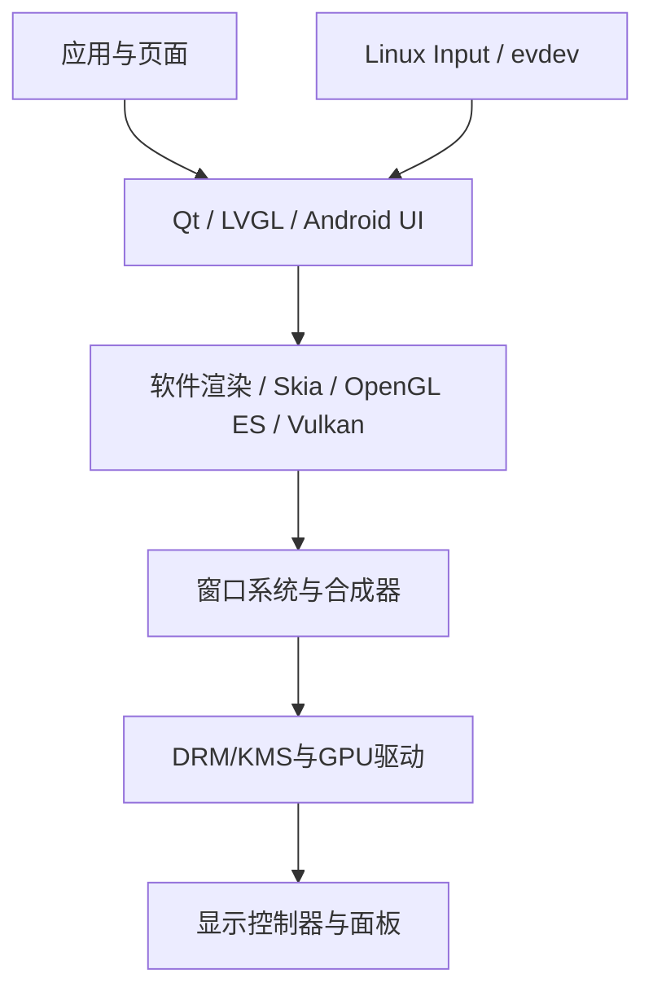

# Linux图形栈技术地图

## 层级

| 层级 | 常见技术 |
|---|---|
| GUI框架 | Qt、LVGL、Android UI |
| 绘图库/API | Skia、Cairo、OpenGL ES、Vulkan |
| 窗口与合成 | Wayland、Weston、SurfaceFlinger |
| 显示管理 | DRM/KMS |
| 输入 | Linux Input、evdev |
| 驱动 | GPU、显示控制器、面板、触摸 |

Qt、OpenGL ES、Wayland和DRM/KMS并非同层替代项。当前目标是理解位置并完成框架适配，不深入GPU驱动内部。

## 权威来源

- [Qt for Embedded Linux](https://doc.qt.io/qt-6/embedded-linux.html)
- [Linux DRM/KMS Documentation](https://docs.kernel.org/gpu/drm-kms.html)

## 关联主题

- [[04-嵌入式Linux与RK/RK技术地图]]
- [[06-图形界面开发/输入系统]]
