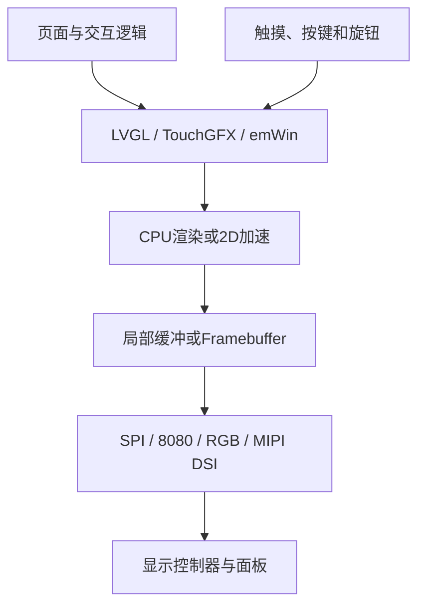

# MCU图形界面技术地图

## 框架定位

| 框架 | 定位 |
|---|---|
| LVGL | 开源、跨平台，第一主线 |
| TouchGFX | STM32生态和图形工具结合紧密 |
| emWin | 成熟商业嵌入式GUI，了解定位 |

## 显示路径

- SPI：引脚少，适合小屏、OLED和电子纸。
- 8080/FMC：并行传输，带宽高于SPI。
- RGB/LTDC：持续扫描Framebuffer，对RAM和带宽要求高。
- MIPI DSI：高带宽串行显示。

## 权威来源

- [LVGL Documentation](https://docs.lvgl.io/)
- [STM32 TouchGFX](https://www.st.com/en/embedded-software/x-cube-touchgfx.html)

## 关联主题

- [[06-图形界面开发/显示缓冲与刷新]]
- [[06-图形界面开发/输入系统]]
- [[03-MCU固件开发/RTOS/RTOS技术地图]]
