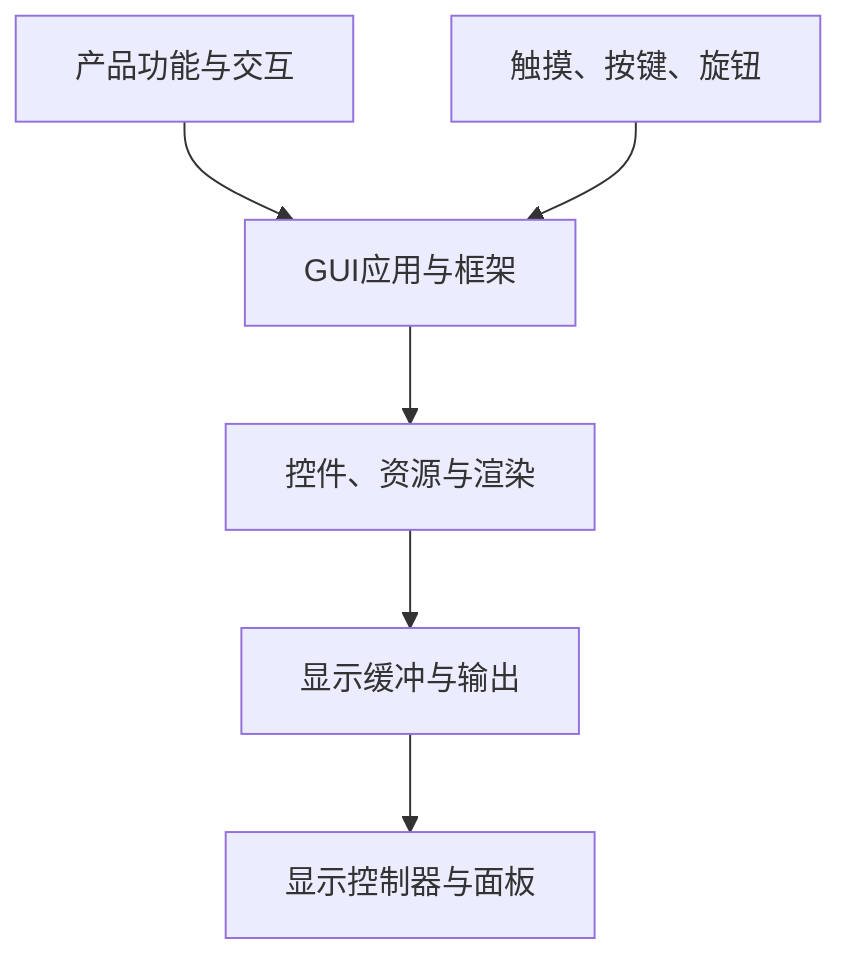

# 图形界面开发入口

## 总体关系

图形界面开发包含GUI应用、框架、资源、渲染、显示输出、输入系统和性能优化。GUI框架只是其中一个子集。

## 子地图

- [[06-图形界面开发/MCU图形界面技术地图]]
- [[06-图形界面开发/Linux图形栈技术地图]]
- [[06-图形界面开发/显示缓冲与刷新]]
- [[06-图形界面开发/输入系统]]
- [[06-图形界面开发/图形资源与性能]]

## 关系判断

- LVGL、TouchGFX、Qt属于GUI框架或平台。
- 显示驱动是GUI输出的下游。
- 触摸和按键是独立输入支线。
- RTOS是运行环境，不是GUI父级。
- GPU和DMA2D是可选加速能力，不是GUI前提。

## 第一实践路线

MCU基础 → 显示模组驱动 → LVGL → 输入适配 → RTOS协作 → 资源与性能优化。
