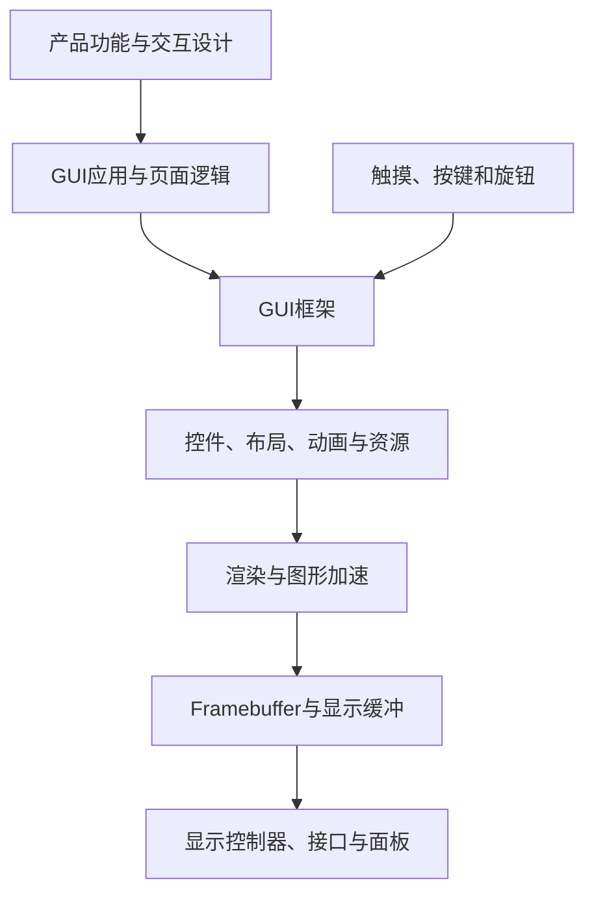
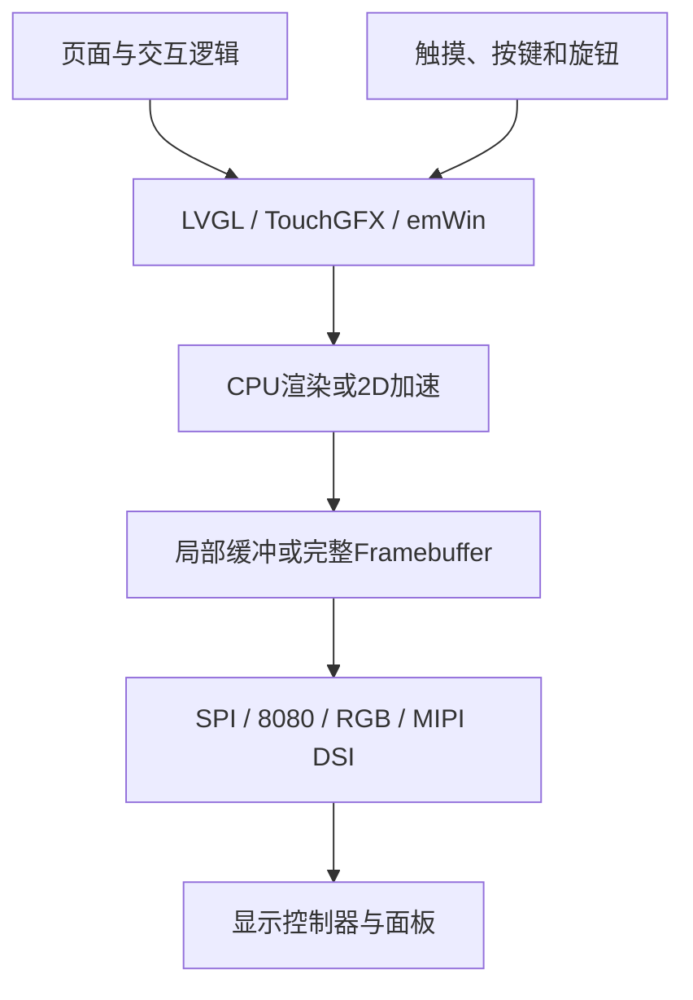
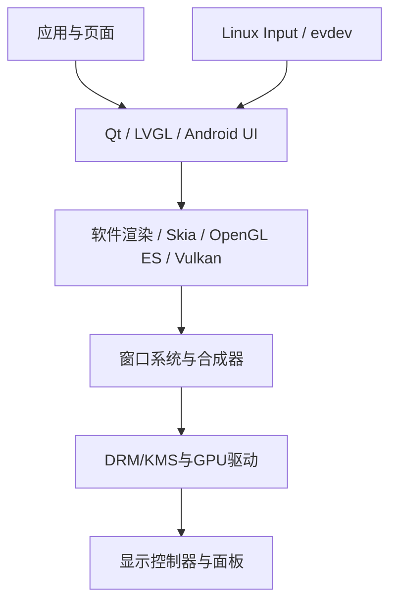

# 图形界面开发技术地图

## 定位

图形界面开发是横跨应用、GUI框架、渲染、显示输出、输入设备和资源管理的技术集合。GUI框架只是其中一个子集。

## 总体链路



## 集合关系

```text
图形界面开发
├─ GUI应用与页面逻辑
├─ GUI框架
├─ 图形资源
├─ 渲染与加速
├─ 显示输出
├─ 输入系统
└─ 内存与性能优化
```

- LVGL、TouchGFX、Qt属于GUI框架或GUI平台，不代表完整显示链路。
- 显示驱动是GUI输出的下游。
- 触摸、按键和旋钮是独立的输入支线，在GUI框架汇合。
- RTOS是运行和调度环境，不是GUI的父级。
- GPU和DMA2D是可选加速能力，不是GUI成立的前提。

## MCU图形链路



### MCU框架

| 框架 | 定位 |
|---|---|
| LVGL | 开源、跨平台，适合作为首个通用GUI框架 |
| TouchGFX | STM32生态结合紧密，适合STM32专用图形方案 |
| emWin | 成熟商业嵌入式GUI，了解其定位即可 |

### MCU显示输出

| 接口或控制器 | 典型特点 |
|---|---|
| SPI | 引脚少、带宽较低，常见于小屏和电子纸 |
| 8080/FMC | 并行传输，带宽高于SPI |
| RGB/LTDC | 持续扫描Framebuffer，RAM和带宽要求高 |
| MIPI DSI | 高速串行显示，常见于高性能MCU和MPU |

## RK/Linux图形链路



### Linux层次

| 层级 | 常见技术 |
|---|---|
| GUI应用框架 | Qt、LVGL、Android UI |
| 绘图库 | Skia、Cairo |
| 图形API | OpenGL ES、Vulkan |
| 窗口和合成 | Wayland、Weston、SurfaceFlinger |
| 显示管理 | DRM/KMS |
| 输入 | Linux Input、evdev |
| 内核驱动 | GPU、显示控制器、面板、触摸 |

这些技术不是必须全部同时使用。Qt是GUI框架，OpenGL ES/Vulkan是渲染API，Wayland是窗口与合成体系，DRM/KMS位于更下游。

## 资源链

```text
设计稿
→ 字体、图片和图标
→ 转换、压缩或打包
→ 固件或文件系统
→ 运行时加载与解码
→ 渲染
```

MCU需要重点关注Flash、RAM、字库和图片解码开销；RK/Linux更关注GPU纹理、文件系统、启动时间和资源更新。

## 性能因素

GUI性能由CPU、RAM、内存带宽、显示接口带宽、分辨率、色深、刷新区域、图片解码、图形加速和任务调度共同决定。

以800×480、RGB565为例，单个完整Framebuffer约为：

```text
800 × 480 × 2 = 768000 bytes
```

双缓冲约需1.5 MiB，尚未包含控件、图片、字体和任务栈。

## 学习顺序

```text
MCU基础
→ 常用外设接口
→ 显示屏驱动
→ LVGL
→ 触摸与输入
→ RTOS协作
→ 资源与性能优化
→ RK/Linux图形栈概览
```

首条实践路线建议使用“MCU + 显示模组 + LVGL”，不要求先学习GPU、DRM/KMS或复杂显示硬件。
